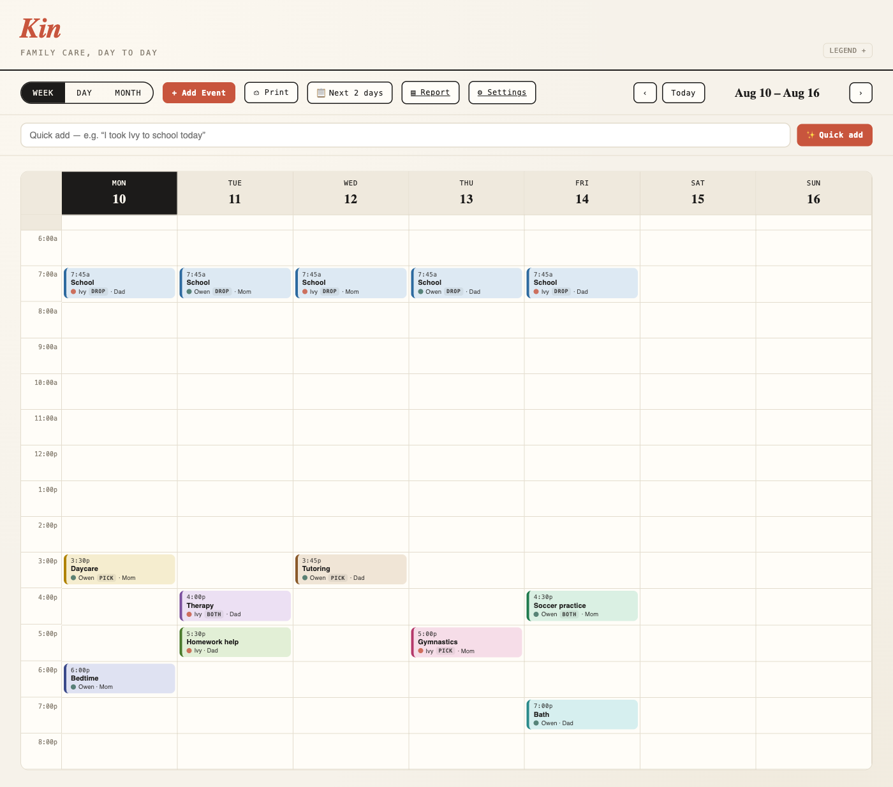

# Kin

A self-hosted calendar for tracking what each parent does for your kids — transport (school, tutoring, therapy, daycare, sports, gymnastics) plus hands-on care (meals, bedtime, homework, medical, and more) — with an exportable per-parent involvement report. Week, day, and month views, color-coded by child and activity type, with single-user password login and persistent SQLite storage.

Built with Next.js (App Router) + better-sqlite3. Ships as a single Docker image, deployable on Coolify via the included `docker-compose.yml`.



## What's inside

- **Three views** — weekly grid, daily agenda, monthly overview.
- **Events** — title, type, child, trip kind (drop-off / pickup / both), date, time, and an optional "who's driving" note. Click any slot to add; click an event to edit or delete.
- **Two children preloaded** — generic placeholders in terracotta and green. Rename them in **⚙ Settings → Family** after first run.
- **Parent-time schedules** — set who has the kids over time with a preset rotation (every-other-weekend, week-on/week-off, 2-2-3, 2-2-5-5, 3-4-4-3, alternating) or a custom cycle, plus date-range holiday/summer overrides. The on-duty parent shows on every calendar view; toggle it on/off. Parents are renamable in-app.
- **Auth** — one password, set via environment variable. Sessions are HMAC-signed cookies; no accounts table, no external auth service.
- **Storage** — SQLite file under `/app/data`, mounted to a Docker volume so it survives redeploys.

## Required environment variables

| Variable       | Purpose                                              |
|----------------|------------------------------------------------------|
| `APP_PASSWORD` | The password you type on the login screen.           |
| `AUTH_SECRET`  | Long random string used to sign session cookies.     |

Generate a secret with:

```bash
openssl rand -hex 32
```

## Deploy on Coolify

1. Push this folder to a Git repo Coolify can reach.
2. In Coolify, create a new resource → **Docker Compose**, and point it at this repo. Coolify will detect `docker-compose.yml`.
3. Set the two environment variables (`APP_PASSWORD`, `AUTH_SECRET`) in the resource's **Environment Variables** tab.
4. Make sure the volume `tracker_data` is preserved across deploys (Coolify does this by default for named volumes).
5. Deploy. Point your domain at the service; Coolify's proxy handles TLS. The app listens on port 3000 internally.

> Because the app sets `secure` cookies in production, serve it over HTTPS (Coolify's proxy does this for you). Accessing it over plain HTTP on a public host will prevent login from sticking.

## Run locally with Docker

```bash
cp .env.example .env      # then edit APP_PASSWORD and AUTH_SECRET
docker compose up --build
```

Open http://localhost:3000.

## Run without Docker (development)

Requires Node 20+ and a toolchain for native modules (`python3`, `make`, `g++`).

```bash
npm install
export APP_PASSWORD=yourpassword
export AUTH_SECRET=$(openssl rand -hex 32)
npm run dev
```

## Changing the children

The two kids are seeded once, on the first run, in `lib/db.js`. To rename them or change colors before deploying, edit the two `insert.run(...)` lines. After the database already exists, update the `children` table directly (e.g. with `sqlite3 data/tracker.db`).

## Parent-time scheduling

Click **⧉ Parent time** to define which parent has the kids:

- **Rotation** — pick a preset (every-other-weekend, week-on/week-off, 2-2-3,
  2-2-5-5, 3-4-4-3, alternating) or build a custom 1–4 week cycle, choose the two
  parents and the start date, and see a live preview + the resulting split. Add a
  date-bounded rotation (e.g. a summer block) under "Limit to a date range."
- **Holidays & overrides** — add date ranges (Thanksgiving, spring break, a swap)
  that take precedence over the rotation.
- **Parents** — rename and recolor the two parents; the change flows through the
  calendar, legend, and report.

The on-duty parent appears as a band in week view, a banner in day view, and a
tint + initial in month view. The **Schedule** toggle hides it. Nothing is stored
as events — the schedule is computed, so editing a rotation updates the past and
future at once. See `docs/parent-time-schedules.md` for the model and presets.

## Data & backups

The record lives in `data/tracker.db` (with `-wal`/`-shm` companions while running).

**Do not `cp tracker.db`** — with WAL journaling that can capture a near-empty file.
For a manual snapshot use SQLite's online backup, which is WAL-safe:

```bash
sqlite3 data/tracker.db ".backup 'backup-$(date +%F).db'"
```

**Automated backups:** Litestream runs **inside the app container** (see `Dockerfile` +
`docker-entrypoint.sh`), continuously replicating `tracker.db` to a Cloudflare R2 bucket
with point-in-time recovery — Coolify deploys the image directly, so there is no separate
sidecar. Set `R2_BUCKET`, `R2_ENDPOINT`, `R2_ACCESS_KEY_ID`, `R2_SECRET_ACCESS_KEY` in
Coolify; with all four set, the container starts the server under Litestream automatically.

**Restore drill (run periodically — an untested backup is not a backup).** Runs from any
machine with the `litestream` binary, the four `R2_*` vars exported, and `litestream.yml`:

```bash
litestream restore -o /tmp/restored.db -config litestream.yml /app/data/tracker.db
sqlite3 /tmp/restored.db "PRAGMA integrity_check; SELECT COUNT(*) FROM events;"
```

A faithful JSON export of the full record (including the edit/delete audit trail) is also
available to the logged-in user at `GET /api/export`.

## Connect an agent (MCP)

Kin exposes an [MCP](https://modelcontextprotocol.io) server with read tools (`get_context`,
`list_events` — which also surfaces the computed on-duty parent — and `involvement_report`) and
event-write tools (`log_event`, `update_event`, `delete_event`, `log_events_bulk`). A token
**cannot** change custody schedules, seal months, or mint share links — that management stays
in the app.

**Mint a token in the app: ⚙ Settings → Agent access (MCP).** Each agent gets its own named,
revocable token (shown once; only its HMAC is stored; last-used is tracked). With no token
minted and no env var set, the endpoints return 503.

- **Claude Code (bearer header):**
  `claude mcp add --transport http kin https://kin.example.com/api/mcp --header "Authorization: Bearer <minted token>"`
- **Claude Desktop:** Settings → Connectors → Add custom connector → paste the connector URL
  (`https://kin.example.com/api/link/<token>/mcp`). Or, in `claude_desktop_config.json` (stdio-only), bridge
  with `{"command":"npx","args":["mcp-remote","https://kin.example.com/api/mcp","--header","Authorization: Bearer <minted token>"]}`
- **Codex (`~/.codex/config.toml`):** `[mcp_servers.kin]` with `url = "https://kin.example.com/api/mcp"`
  and `bearer_token_env_var = "KIN_MCP_TOKEN"` (set that env var to the minted token; older Codex
  builds also need `experimental_use_rmcp_client = true`)
- **ChatGPT (developer mode, paid plan):** Settings → Connectors → add a connector → paste the connector
  URL (`https://kin.example.com/api/link/<token>/mcp`) with Authentication: None; write actions confirm per use
- **claude.ai (custom connector, no header support):** paste the connector URL shown at mint
  (`https://kin.example.com/api/link/<token>/mcp` — the token is the credential, keep it private)
- **A stdio-only client:** bridge with
  `npx mcp-remote https://kin.example.com/api/mcp --header "Authorization: Bearer <minted token>"`

Revoke any token in Settings; it stops working immediately. The `KIN_MCP_TOKEN` env var still
works as an optional single-token fallback (legacy deploys). Both are independent of your login
password; note that rotating `AUTH_SECRET` invalidates all minted tokens (they're HMAC-keyed on
it, like share links).

## Notes on the stack

- `output: 'standalone'` keeps the runtime image small (only the server bundle + static assets, not the full `node_modules`).
- `better-sqlite3` is a native module; the Dockerfile's build stage installs `python3/make/g++` to compile it, and it's kept out of the Next bundle via `serverExternalPackages`.
- The proxy (Next 16's renamed middleware) does a fast cookie-presence check to gate pages; the API routes do full HMAC verification on every request.

## License

AGPL-3.0 — see [LICENSE](LICENSE). You're free to self-host, modify, and share this; if you
run a modified version as a network service for others, you must make that version's source
available to its users.
